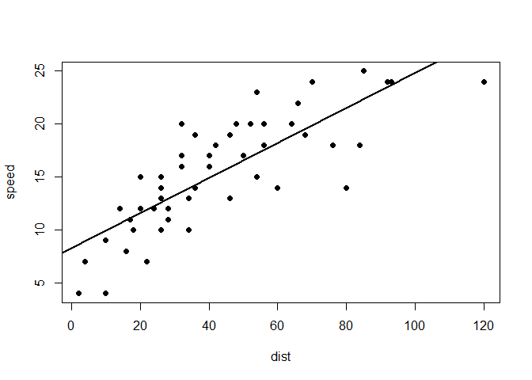

A mock project
================
Alexandros Topaloudis

# The problem

Using the cars dataset (“The data give the speed of cars and the
distances taken to stop. Note that the data were recorded in the 1920s”)
plot the lm between speed and stopping distance. What does the
relationship look like ? Can you produce the summary of the linear model
?

``` r
data(cars)
with(cars,plot(speed~dist,pch=16))
# add line 
with(cars, abline(lm(speed~dist),lwd=2))
```

<!-- -->
