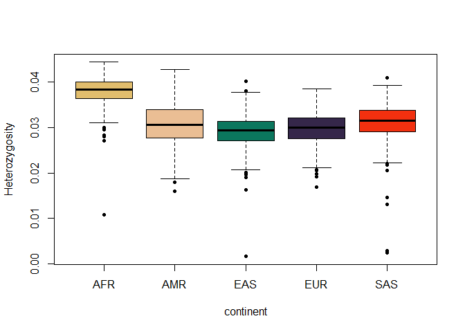
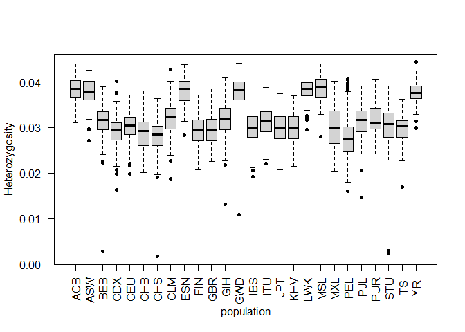
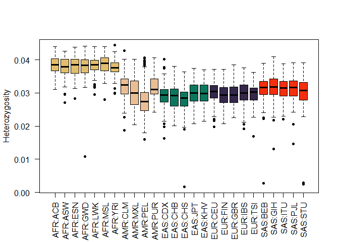
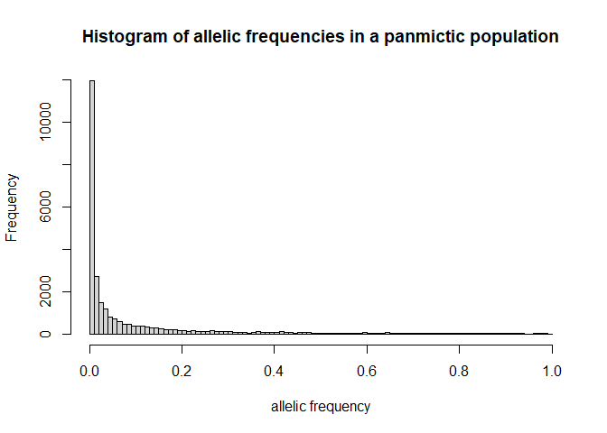
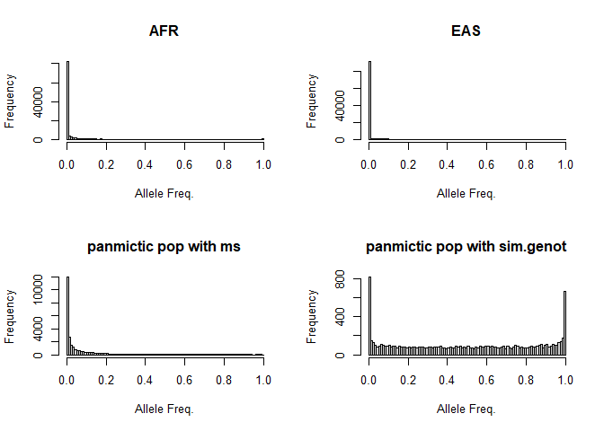
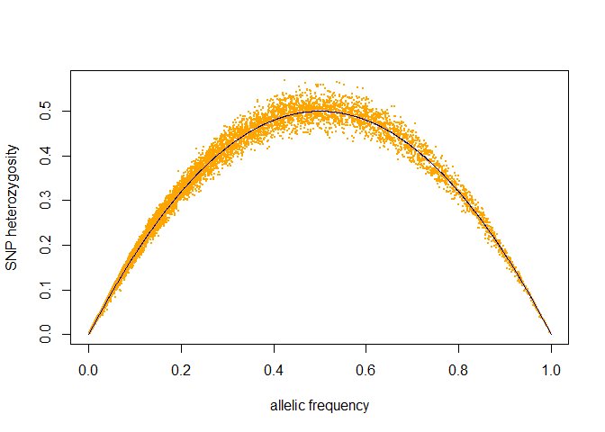
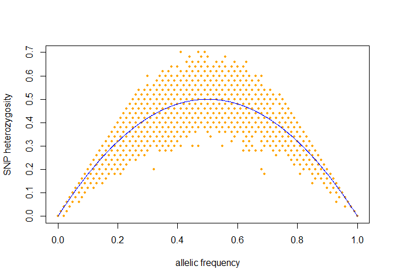

Practical 1: Loading genetic data into R, simulating genetic data,
allelic frequencies
================
Jerome Goudet and Bruce Weir
2022-07-06


# Importing data into R

``` r
library(hierfstat)
library(gaston)
library(SNPRelate)
library(JGTeach)
library(wesanderson)
library(knitr)
### TIPS ###
# We first load all the libraries we will need for this practical. 
# Make sure you have those installed 
# If not then please visit https://www2.unil.ch/popgen/teaching/SISG22/
```

1.  download the [first 20 megabytes of chromosome
    22](https://www2.unil.ch/popgen/teaching/SISGData/chr22_Mb0_20.recode.vcf.gz)
    (this is a subset of chromosome 22, data from all chromosomes can be
    downloaded from [the 1000 genome download
    site](http://ftp.1000genomes.ebi.ac.uk/vol1/ftp/release/20130502/).
    From a unix command prompt, enter `wget url`; from a browser, just
    download the file.

2.  Import this file in R using package `hierfstat` (check the packages
    vignettes,
    [import](https://cran.r-project.org/web/packages/hierfstat/vignettes/import.html)
    ) and its function `read.VCF` using the following commands:

``` r
ch22 <- read.VCF("chr22_Mb0_20.recode.vcf.gz")
### TIPS ### 
# Make sure to specify the correct path to the file! 
# if your file is in the parent directory of your script then add a '../' 
```

How many individuals in the data set? How many SNPs? Explore the
structure of the `ch22` object with `str(ch22)`. Describe the different
components

> for answers, see section 2.3 of [gaston
> vignette](https://cran.r-project.org/web/packages/gaston/vignettes/gaston.pdf)

<details>
<summary>
Answer
</summary>

``` r
#ch22 matrix with nrows inds and ncol snps
dim(ch22)
str(ch22)
```

</details>

3.  \[optional\] Other ways of importing VCF files into R

-   If you want to discover the
    [PLINK](https://www.cog-genomics.org/plink/2.0/) program: using this
    software, create a `bed` file containing all biallelic SNPs on this
    chromosome, excluding alleles other than `A,T,G,C,a,t,g,c`. For
    this, assuming your file is names `chr22_Mb0_20.recode.vcf.gz` type
    the following commands:

<!-- -->

    plink2 is essential for the --max-alleles option to work

    plink2 --vcf chr22.vcf.gz --make-bed  --snps-only just-acgt
    --max-alleles 2 --out chr22.1kg

    ### TIPS ###
    # You can run plink with R using the system() command.
    # example if your plink.exe and the vcf.gz is in your working directory (getwd() to see where you are - setwd() to change it)
    # you can run > system("plink2.exe --vcf chr22_Mb0_20.recode.vcf.gz --make-bed --snps-only just-acgt --max-alleles 2 --out chr22.1kg")
    # from your R console to execute the software

You can explore [PLINK](https://www.cog-genomics.org/plink/2.0/) website
to discover some of its capabilities.

-   \[optional\] import this using `R` and `gaston`, using the following
    commands from the `R` prompt:

``` r
chr22 <- read.bed.matrix("chr22.1kg") # reads the output of plink
```

-   \[optional\] using `SNPRelate`, convert the chromosome 22 VCF file
    into a GDS file, and open this file. You can find more about
    SNPRelate
    [here](https://www.bioconductor.org/packages/release/bioc/html/SNPRelate.html).

``` r
snpgdsVCF2GDS("chr22.vcf.gz","chr22.gds") # makes GDS file 
f <- snpgdsOpen("chr22.gds") # reads GDS file 
```

4.  Show boxplots of individual heterozygosity as a function of their
    continent of origin (you will have to load the sample description
    for this, and make sure that the order of samples is the same in the
    bed file and the description file). This can be done with the
    following commands:

``` r
samp.desc.fname <- "integrated_call_samples_v3.20130502.ALL.panel" # file name
ftp.path <- "ftp://ftp-trace.ncbi.nih.gov/1000genomes/ftp/release/20130502/" # web link
samp.desc.url <- paste0(ftp.path,samp.desc.fname) 
samp.desc <- read.table(samp.desc.url,header=TRUE,stringsAsFactors = TRUE) # read.table can also read web links
```

<details>
<summary>
Answer
</summary>

``` r
# checks that the order of samples in bed file and description file are the same
all.equal(as.character(ch22@ped$id),as.character(samp.desc$sample)) 
```

    ## [1] TRUE

``` r
# per coninent (super_pop)
boxplot(ch22@ped$hz ~ samp.desc$super_pop, ylab='Heterozygosity', xlab='continent', pch=20,
        col=wes_palette('Rushmore1'))
```

<!-- -->

``` r
# and per population
boxplot(ch22@ped$hz ~ samp.desc$pop,las=2, ylab='Heterozygosity', xlab='population', pch=20)
```

<!-- -->

``` r
# same, sorted by continent
boxplot(ch22@ped$hz ~ with(samp.desc,factor(super_pop:pop)), las=2 ,ylab='Heterozygosity', xlab='', pch=20,
        col=wes_palette('Rushmore1')[ rep(c(1:5), times=c(7,4,5,5,5)) ]) 
```

<!-- -->
</details>

-   Which continent shows the largest individual heterozygosity? Which
    the lowest? Which the highest variance in individual heterozygosity?
    There is also a slot `ch22@snps$hz` in the `ch22` object. How does
    it differ from `ch22@ped$hz`?

# Simulating Genetic/Genomic data

5.  Simulating genetic data: using `hierfstat` and its function
    `sim.genot` (read its help page!), generate a data set with the
    genotypes of 50 sampled individuals at 100 biallelic loci from each
    of 4 populations, where the populations are made of 1000 individuals
    and exchange migrants at a rate of 0.001. Leave mutation rate and f
    to their default. From the `R` prompt:

<details>
<summary>
Answer
</summary>

``` r
#precede the function name with ? to get help, e.g. ?sim.genot
dat<-sim.genot(nbpop=4,nbloc=100,nbal=2,size=50,N=1000,mig=0.001)
```

</details>

-   Describe the data set you have just generated. How many rows and
    columns? What contains the first column? the second? the third?

``` r
# dim to get the number of rows and columns
dim(dat)

# column names
head(names(dat))

# structure of the data set
str(dat)
```

-   Use the function `hierfstat::biall2dos` to convert `dat` to dosage
    format:

``` r
dos <- biall2dos(dat[,-1])
str(dos)
```

-   Why the `[,-1]` one in the previous command?

-   Could an `fstat` format dataset with more than 2 alleles be
    converted to dosage format? To answer this, browse `hierfstat` help

-   \[optional\] explore `hierfstat` help and identify other functions
    allowing to simulate genotypic data. Describe them briefly

6.  \[optional\] Using `ms` or `mspms` (outside `R`, read the manual),
    simulate a similar dataset (you might want more loci), and import it
    into R using the function `hierfstat::ms2bed`. To simulate the data,
    issue at the command prompt (outside `R`) the following command:

<!-- -->

    ms 400 2 -s 50 -r 40 100000 -I 4 100 100 100 100 4 > islM1.txt 

    ### TIPS ###
    # Running ms requires some basic terminal skills! Skip if uncomfortable 
    # To install ms you need to download the folder specified in the course website
    # then through a linux terminal (ex WSL) you can $ tar -xvf ms.tar.gz && cd msdir/ && gcc -o ms ms.c streec.c rand1.c -lm 
    # then run ms as ./ms 

7.  using the file you have just generated or [a similar one from the
    course
    website](https://www2.unil.ch/popgen/teaching/SISGData/t4r4p1.txt)
    (in which case, you’ll have to download it first) load it into R:

``` r
islm1 <- ms2bed("https://www2.unil.ch/popgen/teaching/SISGData/t4r4p1.txt")
```

-   explore the structure of the `islm1` object. How many individuals?
    How many loci?

<details>
<summary>
Answer
</summary>

``` r
#str(islm1)
dim(islm1)
```

</details>

# Allelic frequencies

8.  Using either data from a panmictic population you have simulated
    with `ms` or the file
    [pan.txt](https://www2.unil.ch/popgen/teaching/SISGData/pan.txt)
    provided, produce a histogram of allele frequencies

<details>
<summary>
Answer
</summary>

``` r
pan <- ms2bed("pan.txt")
hist(pan@p,breaks=101, xlab='allelic frequency', main='Histogram of allelic frequencies in a panmictic population')
```

<!-- -->

</details>

9.  Produce a histogram of SNP allele frequencies of the first 20
    megabases of chromosome 22 we imported yesterday, from the African
    samples, and then from the East Asian samples. Describe the shape of
    the distribution. How can this be explained? Compare this
    distribution to the distribution of allele frequencies from the `ms`
    simulations we did during practical 1; and to the distribution of
    allelic frequencies generated with `sim.genot`. What can you say
    about how realistic these distributions are (hint: look at
    `?sim.genot`) ?

<details>
<summary>
Answer
</summary>

``` r
ch22 <- read.VCF("chr22_Mb0_20.recode.vcf.gz") # reload chr22 vcf
```

    ## ped stats and snps stats have been set. 
    ## 'p' has been set. 
    ## 'mu' and 'sigma' have been set.

``` r
samp.desc.file <- "https://www2.unil.ch/popgen/teaching/SISG18/integrated_call_samples_v3.20130502.ALL.panel"
samp.desc <- read.table(samp.desc.file,header=TRUE) # reload sample descriptions
# subset samples
AFR <- which(samp.desc$super_pop=="AFR") # which samples are from AFR
EAS <- which(samp.desc$super_pop=="EAS") # which samples are from EAS
par(mfrow=c(2,2)) # plot indexing (this will make the plotting area 2x2)
#AFR hist
hist(ch22[AFR,]@p,breaks=101,main="AFR",xlab="Allele Freq.")
#EAS hist
hist(ch22[EAS,]@p,breaks=101,main="EAS",xlab="Allele Freq.")
#PAN ms hist
hist(pan@p,breaks=101,main="panmictic pop with ms",xlab="Allele Freq.")
#simulate data from a panmictic pop with sim.genot
dat<-sim.genot(nbal=2,nbpop=1,size=100,nbloc=10000)
#convert to dosage
dos<-biall2dos(dat[,-1])
# colMeans(dos) will give twice the frequencies so we /2 
hist(colMeans(dos)/2, breaks=101, main="panmictic pop with sim.genot", xlab="Allele Freq.")
```

<!-- -->

``` r
par(mfrow=c(1,1)) # back to single plots
```

</details>

10. using the shiny app
    [BinomNorm](https://jgx65.shinyapps.io/BinomNorm/) (based on
    function `JGTeach::comp.ci.binom`, compare the accuracy of the Wald,
    binomial, and bootstrap confidence intervals:

-   For a frequency of 0.5 in a sample of 1’000 genes.
-   For a frequency of 0.1 in a sample of 10 genes.
-   For a frequency of 0.1 in a sample of 1’000 genes.  
-   For a frequency of 0.001 in a sample of 1’000 genes.

Focusing on the Wald and exact confidence intervals, infer a rule for
when it is not appropriate to use the Wald confidence interval.

11. Estimate allelic frequency variance from the following genotype
    counts, where `R` designates the count of reference alleles and `A`
    the count of alternate alleles. When is the allelic frequency
    variance the same as binomial variance? Discuss the possible
    shortcomings of using the binomial variance instead of the true
    variance.

|  RR |  RA |  AA |
|----:|----:|----:|
| 100 | 200 | 100 |
| 150 | 100 | 150 |
| 200 |   0 | 200 |
|   4 |  72 | 324 |
|  22 |  36 | 342 |
|  40 |   0 | 360 |

<details>
<summary>
Answer
</summary>

``` r
tab <- matrix(c(100,200,100,150,100,150,200,
      0,200,4,72,324,22,36,342,40,0,360),ncol=3,byrow=TRUE)
tab <- data.frame(tab)
names(tab) <- c("RR","RA","AA") 
tab$PR <- (tab[,1]+tab[,2]/2)/400 # PR for frequency of reference
tab$f <- 1-tab[,2]/400/(2*tab$PR*(1-tab$PR)) # f for inbreeding coefficient 
tab$V <- tab$PR*(1-tab$PR)*(1+tab$f)/2/400 # V for variance from genotype counts
kable(round(tab,digits=5)) 
```

|  RR |  RA |  AA |  PR |   f |       V |
|----:|----:|----:|----:|----:|--------:|
| 100 | 200 | 100 | 0.5 | 0.0 | 0.00031 |
| 150 | 100 | 150 | 0.5 | 0.5 | 0.00047 |
| 200 |   0 | 200 | 0.5 | 1.0 | 0.00062 |
|   4 |  72 | 324 | 0.1 | 0.0 | 0.00011 |
|  22 |  36 | 342 | 0.1 | 0.5 | 0.00017 |
|  40 |   0 | 360 | 0.1 | 1.0 | 0.00023 |

</details>

12. Using either data from a panmictic population you have simulated
    with `ms` or the file
    [pan.txt](https://www2.unil.ch/popgen/teaching/SISGData/pan.txt)
    provided, plot the SNPs heterozygosity against the frequency of the
    alternate allele, and add the line of expected heterozygosity.

<details>
<summary>
Answer
</summary>

``` r
#read pan.txt into a bed object
pan <- ms2bed("https://www2.unil.ch/popgen/teaching/SISGData/pan.txt")
#plot snps hz against p
plot(pan@p, pan@snps$hz, col="orange", pch=20, cex=0.3, ylab='SNP heterozygosity',
     xlab='allelic frequency')

#add expected prop of heterozygotes given the frequency 
p <- 0:1000/1000 
lines(x=p,y=2*p*(1-p),col="darkblue")
```

<!-- -->

</details>

Describe what you see.

What would the figure look like if there was only 50 individuals in the
sample?

<details>
<summary>
Answer
</summary>

``` r
pan50 <- pan[1:50,] # get only 50 individuals
plot(x=pan50@p,y=pan50@snps$hz,col="orange",pch=20,cex=0.8, ylab='SNP heterozygosity',
     xlab='allelic frequency')
lines(p,2*p*(1-p),col="blue")
```

<!-- -->

</details>

**END OF PRACTICAL 1.**
